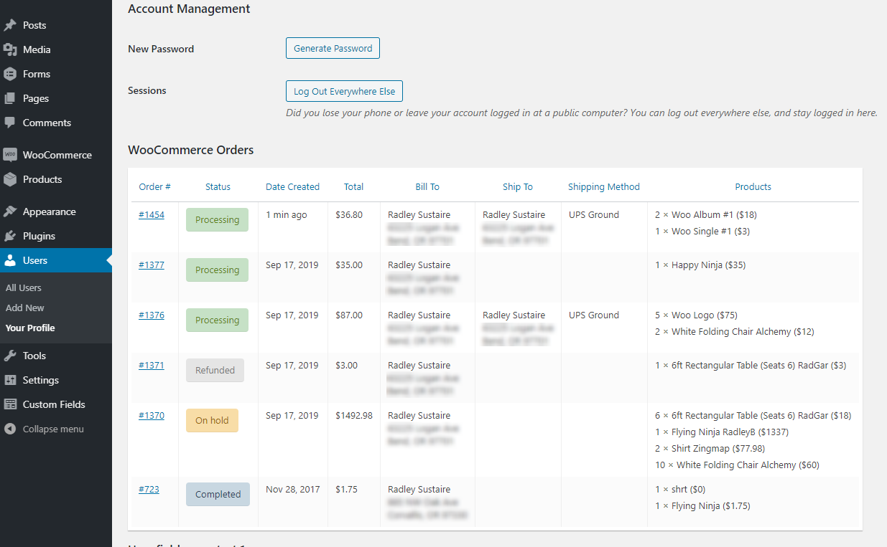

RS WooCommerce Orders on Profile (WordPress Plugin)
==

_Displays a user's WooCommerce orders on their user profile, inside a table._

    Contributors: radgh
    Donate link: https://paypal.me/radgh
    Tags: woocommerce, emails, debugging
    Requires at least: 4.9
    Tested up to: 5.3.1
    Stable tag: 1.1.4
    License: GPLv3
    License URI: http://www.gnu.org/licenses/gpl-3.0.txt

## Description ##

Displays a table of orders on user profile pages. 

New columns can be added with the filter `woop/table_headers`. Data in the table can be customized with the filter `woop/table_data`.

Requires WooCommerce.

## Installation ##

1. Upload the plugin files to `/wp-content/plugins/rs-woocommerce-orders-on-profile/`, or install the plugin through the WordPress plugins screen.
1. Activate the plugin through the 'Plugins' screen in WordPress
1. Navigate to a user's profile screen
1. Locate the WooCommerce Orders table

## Frequently Asked Questions ##

**What is Menu Order for?**

Use that to re-order the messages, lower numbers come first. This is important when you display a message at the same spot for multiple products.

## Screenshots ##

## Changelog ##

### 1.1.4
* Fixed table sorting not working because of incorrect class name

### 1.1.3
* Released on Github

## Upgrade Notice ##

None yet.